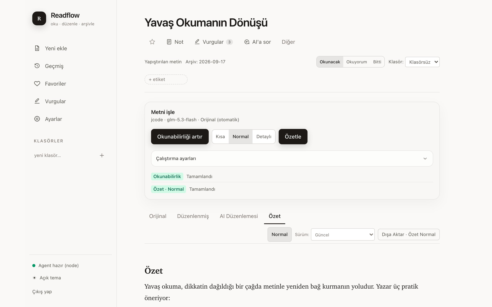
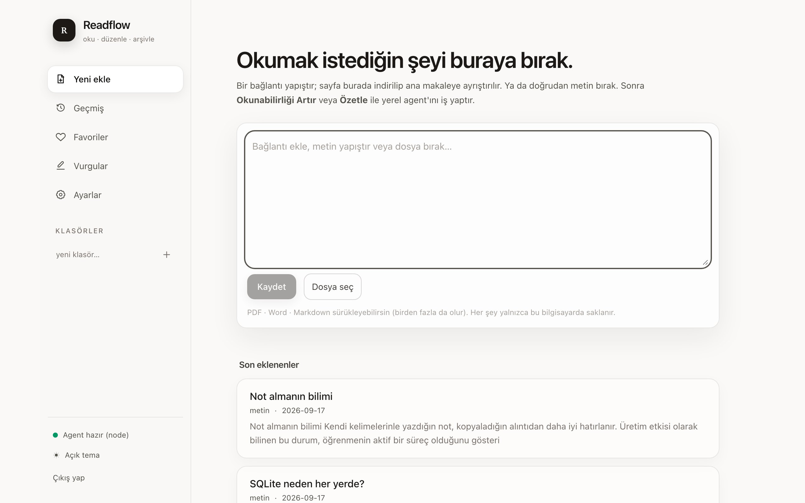
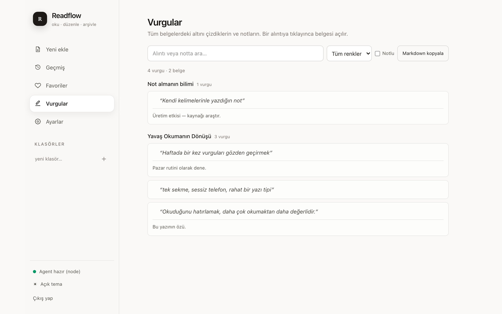

# Readflow

Local-first, AI destekli kişisel okuma ve metin işleme alanı. Chatbot değil; **reader + article extractor + summarizer + archive + export workspace**.

[](https://github.com/fatihdogann/readflow/actions/workflows/ci.yml) · MIT · [Tanıtım sayfası](https://readflow.mehmetfatihdogan.com.tr)



| Ana ekran | Vurgular |
|---|---|
|  |  |

```
Tarayıcı ──▶ Web uygulaması (localhost:3000)
                │  doküman + job yazar
                ▼
            SQLite (WAL)  ◀──  Yerel worker (job kuyruğu)
                ▲                    │ prompt via stdin / stdout
                └── çıktılar         ▼
                          Coding-agent CLI (claude / codex / jcode / …)
```

## Readflow nedir?

- Bir **URL yapıştırırsın**: sayfa sunucu tarafında indirilir, Mozilla Readability ile ana makaleye ayrıştırılır (navigation, reklam, cookie banner gürültüsü atılır, HTML sanitize edilir). Site bot koruması verirse Wayback Machine kopyası denenir.
- Bir **metin yapıştırırsın**: doğrudan arşive kaydedilir.
- Bir **dosya bırakırsın**: PDF, Word (.docx), Markdown ve düz metin sürükle-bırak ya da "Dosya seç" ile eklenir; birden fazla dosya birlikte bırakılabilir. Taranmış (görsel) PDF'ler, makinede `tesseract` + `poppler` varsa yerel OCR ile okunur (Türkçe + İngilizce, ilk 50 sayfa).
- **Toplu içe aktarırsın**: `pnpm import:files <klasör|dosya>` — Markdown/TXT/HTML/PDF/DOCX klasörleri ve okuma uygulamalarının dışa aktarımları (Instapaper, Pocket, Readwise CSV'leri; tarayıcı/Pocket yer imi HTML'i). Arşivde olan bağlantılar ve aynı içerikli belgeler atlanır; etiketler korunur.
- **Telefondan paylaşırsın**: iPhone'da Kestirmeler, Android'de PWA paylaşım hedefi ile bağlantı veya metin arşive gider (Ayarlar'da kurulum adımları).
- **Bookmarklet ile gönderirsin**: yer imleri çubuğundaki "Readflow'a gönder" düğmesi, açık sekmenin HTML'ini doğrudan Readflow'a yollar. Sunucu siteye hiç istek atmadığı için bot koruması, paywall, çerez duvarı ve JavaScript ile üretilen sayfalar da eklenebilir. Ayarlar ekranından kurulur.
- Dört içerik türü nettir: **Orijinal** (asla değişmez), **Düzenlenmiş** (kullanıcının kendi sürümü, revision kontrollü), **AI Düzenlemesi** (okunabilirlik çıktısı) ve **Özet** (Kısa/Normal/Detaylı).
- AI işlemleri **remote LLM API'si ile değil**, kendi bilgisayarındaki coding-agent CLI üzerinden yapılır. **Hiçbir LLM API key istemez.** CLI'ın kendisi kendi oturumuyla uzak model sağlayıcısına bağlanabilir; Readflow'un verisi (dokümanlar, notlar, çıktılar) ise yalnızca `~/.readflow/` içinde saklanır — "yerel saklama" ile "AI tamamen çevrimdışı" aynı şey değildir.
- İş oluşturulduğunda **kaynak metin, notlar ve AI yapılandırması snapshot olarak sabitlenir**; sonraki değişiklikler bekleyen işi etkilemez. Retry aynı snapshot ile çalışır.
- Arama, favoriler, klasörler, etiketler, okuma durumu (Okunacak/Okuyorum/Bitti), domain/AI filtreleri ve "Notlu"/"Düzenlenmiş" filtreleriyle arşivde gezilir. Her AI çıktısının değişmez sürüm geçmişi tutulur.
- **Vurgular** sayfası tüm belgelerdeki altı çizilenleri ve notları bir arada gösterir: renk/metin/notlu filtreleri, belgeye atlama ve Markdown olarak panoya kopyalama.
- Çıktılar panoya, TXT, Markdown, PDF (yazdır), DOCX olarak yerel olarak dışa aktarılır; Notion/Telegram adapter'ları env ile kurulur.

## Gereksinimler

- Node.js 22+ (`.nvmrc`)
- pnpm (sürüm `packageManager` alanında; `corepack enable` yeterli)
- AI işlemleri için: authenticated bir coding-agent CLI (`claude`, `codex`, `jcode`, …) **veya** MCP destekleyen bir agent
- GitHub CLI (`gh`) yalnızca repo oluşturmayı otomatikleştirmek istersen

## Kurulum

```bash
git clone <repo-url> readflow && cd readflow
pnpm install
pnpm db:migrate   # opsiyonel: ilk açılışta migration otomatik çalışır
```

## Günlük kullanım (Mac, production)

```bash
pnpm build
pnpm app:start     # web yalnız 127.0.0.1:3000 + yerel worker
pnpm app:install   # aynısını launchd servisi olarak kur (ayarlar: ~/.readflow/app.env)
tailscale serve --bg 3000   # yalnız kendi tailnet cihazlarından HTTPS erişim
```

Production'da `READFLOW_AUTH_USERNAME`, `READFLOW_AUTH_PASSWORD` (≥10) ve `READFLOW_SESSION_SECRET` (≥32) zorunludur; eksikse uygulama başlamaz. Adım adım kurulum: [docs/INSTALL.md](docs/INSTALL.md). Sağlık kontrolü: `GET /api/health`.

## Geliştirme

```bash
pnpm dev:all      # web + worker birlikte
pnpm dev:web      # yalnızca web (localhost:3000)
pnpm dev:worker   # yalnızca job worker
pnpm dev:mcp      # MCP sunucusu (stdio) — agent konfigürasyonundan çalıştırılır
pnpm test         # vitest
pnpm test:e2e     # production build + Playwright masaüstü/mobil akışları
pnpm typecheck    # tsc --noEmit
pnpm lint         # eslint
pnpm build        # production build
pnpm db:migrate   # şema sürümünü yazdırır
pnpm diagnose     # kurulumu salt-okunur denetler (Node, DB, giriş, agent, OCR, servis, sağlık)
pnpm import:files <yol>   # toplu içe aktarma
```

## Agent CLI bağlantısı

AI işlemleri dört adımlı bir zincirle çalışır: web arayüzü job'a **kaynak metin + notlar + AI yapılandırmasını snapshot olarak** yazar → yerel worker bu snapshot ile adapter kurar → prompt CLI'ın **stdin**'ine yazılır (jcode gibi argv isteyenler için `transport: argv`), sonuç **stdout**'tan okunur → çıktı değişmez revizyonla SQLite'a kaydedilir.

**Öncelik sırası:** environment kilidi (`READFLOW_AGENT_MODE` / `READFLOW_AGENT_CMD` — Ayarlar'da "Environment tarafından yönetiliyor" olarak gösterilir, UI değiştiremez) → işte açık profil seçimi → kaydedilmiş varsayılan profil → otomatik tespit.

**Ayarlar → Yerel AI ekranı:** kurulu CLI'lar (claude/codex/jcode), help çıktısından doğrulanmış yetenekleri (`--model`, `--provider`, read-only sandbox), sürümleri; profiller; "Bağlantıyı doğrula" (örnek metinle gerçek çalışma testi — CLI bulunması ile oturum doğrulaması ayrı şeylerdir) ve "Varsayılan yap". Model/profil kimlikleri serbest metin olarak girilir; CLI'ın help'inde doğrulanmayan bayrak kullanılmaz. Doğrulama ve profil mutasyonları yalnızca localhost üzerinden kabul edilir.

**Manuel/env bağlama** (`.env.local`):

```bash
READFLOW_AGENT_CMD="claude -p"          # prompt stdin'den, sonuç stdout'tan
READFLOW_AGENT_CMD="codex exec -"       # worker repo kökünde çalışır (git repo gerekli)
READFLOW_AGENT_CMD="jcode run"          # jcode mesajı argüman ister: READFLOW_AGENT_PROMPT_VIA=argv
READFLOW_AGENT_MODE=none                # AI'yı tamamen kapat; işler pending kalır
READFLOW_AGENT_TIMEOUT_MS=120000

# OCR (taranmış PDF) — sistem tesseract + pdftoppm varsa otomatik
READFLOW_OCR=off                # tamamen kapat
READFLOW_OCR_LANG=tur+eng       # kurulu tesseract dilleri
READFLOW_OCR_MAX_PAGES=50       # bir PDF'ten okunacak en fazla sayfa
```

> Çok sayfalı taramalarda web isteği uzun sürer; 50 sayfanın üstündeki belgeleri
> `pnpm import:files <dosya>` ile ekle (HTTP zaman aşımı yoktur).

Kendi script'in de olur — sözleşme basit: stdin → prompt, stdout → Markdown çıktı. Denemek için: `READFLOW_AGENT_CMD="node scripts/mock-agent.mjs"`.

**Güvenilirlik:** iş sahipliği + lease modeli sayesinde ikinci bir worker veya MCP tüketici aynı işi alamaz; uzun AI çağrılarında kalp atışı ve lease ayrı interval'de yenilenir, yalnızca süresi dolmuş işler kurtarılır. Geç gelen eski sahibin sonucu yeni denemeyi ezmez.

## MCP kurulumu

MCP destekleyen agent'lara (ör. `.mcp.json`):

```json
{
  "mcpServers": {
    "readflow": {
      "command": "pnpm",
      "args": ["--dir", "/Users/sen/Desktop/Projeler/readflow", "dev:mcp"]
    }
  }
}
```

Tool'lar: `readflow_list_pending_jobs`, `readflow_get_job`, `readflow_claim_job`, `readflow_complete_job`, `readflow_fail_job`, `readflow_get_document`, `readflow_create_document`, `readflow_list_documents`. Böylece agent, Readflow'un kuyruğunu kendisi çekebilir (worker'a alternatif ikinci entegrasyon yolu).

## Yerel veri ve yedekleme

- Veritabanı: `~/.readflow/readflow.sqlite` (WAL modu), `READFLOW_DATA_DIR` ile değiştirilebilir
- **Yedekleme**: Ayarlar → *Yedeği indir* veya `pnpm db:backup` — WAL ile tutarlı `VACUUM INTO` tam arşivi (`~/.readflow/backups/`). Son yedek 7 günü geçince Ayarlar uyarır. Şema yükseltmeleri de otomatik olarak yükseltme öncesi yedek alır.
- **Geri yükleme / taşıma**: uygulama kapalıyken `pnpm db:restore <dosya>` (`--check` yalnızca doğrular) — bütünlük ve şema denetimi, mevcut veritabanının güvenlik yedeği, tablo sayısı karşılaştırması.
- `.gitignore` yanlışlıkla oluşabilecek `*.sqlite*` ve veri dizinlerini repo dışında tutar

## Dışa aktarma

Her çıktı için **Dışa Aktar** menüsü: Panoya Kopyala, TXT, Markdown, PDF (sunucuda `pdf-lib` ile gerçek `.pdf` üretilir — Türkçe karakterler için gömülü DejaVu fontu), Yazdır (tarayıcı yazdırma diyaloğu), DOCX (yerelde üretilir). Notion ve Telegram için `.env.local` içine `READFLOW_NOTION_TOKEN`, `READFLOW_NOTION_DATABASE_ID`, `READFLOW_TELEGRAM_BOT_TOKEN`, `READFLOW_TELEGRAM_CHAT_ID` girilmeden butonlar uygulamanın geri kalanını bozmadan "kurulmadı" der.

## Gizlilik

Tüm veri (dokümanlar, çıktılar, job geçmişi) yalnızca `~/.readflow/` içinde durur, hiçbir cloud servise gitmez. Repoyu public yapmadan önce `.env.local` dosyası ve veri dizini Git'e asla girmez (gitignore koruması var); yine de `git log --diff-filter=A -- "*.sqlite*" "data/"` ile bir kontrol önerilir.

## Sorun giderme

- **"Agent bağlı değil"**: Ayarlar ekranından profil oluştur + "Bağlantıyı doğrula" çalıştır; ya da `READFLOW_AGENT_CMD` tanımla. `claude` OAuth oturumu dolabilir — terminalden `claude` yazıp login ol, sonra failed işe "Yeniden dene".
- **"Environment tarafından yönetiliyor" kilidi**: `.env.local` içinde `READFLOW_AGENT_MODE`/`READFLOW_AGENT_CMD` var; UI'dan değil env'den yönet.
- **İş "sahiplik" hatası verdi**: işin lease süresi dolup başka tüketici (ikinci worker/MCP) almış; geç gelen sonuç bilinçli olarak reddedildi. Yeniden dene.
- **better-sqlite3 kurulmuyor**: `pnpm rebuild better-sqlite3` — Node sürümün için prebuilt binary yoksa Xcode CLT gerekir.
- **Port 3000 dolu**: `pnpm dev:web -- -p 3001`. Eski Next süreçleri `pkill -f next-server` ile bulunur (Next 16 süreç adını yeniden adlandırır).
- **Node 26'da "ExperimentalWarning: localStorage"**: `docx` paketinin Node 26 uyumluluk shim'i modül yüklenirken global `localStorage`'a dokunur; zararsızdır ve docx güncellemesiyle kaybolur. Readflow'un kendi kodu Node tarafında localStorage'a erişmez.
- **URL eklenemiyor (HTTP 403/401)**: site bot koruması uyguluyor veya oturum istiyor. Readflow önce Wayback Machine kopyasını dener; o da yoksa iki yol kalır: Ayarlar'daki **bookmarklet** (önerilen — sayfayı kendi tarayıcından gönderir) veya hata kutusunda açılan **sayfa kaynağını yapıştır** alanı.

## Mimari

Readflow bağımsız süreçler halinde çalışır; hepsi aynı SQLite dosyasını **WAL** modunda paylaşır ve birbirine yalnızca veritabanı üzerinden konuşur:

| Süreç | Komut | Sorumluluk |
|---|---|---|
| Web uygulaması | `pnpm dev:web` | Next.js 16 (App Router): UI, REST API, URL/dosya extraction, export servisleri |
| Worker | `pnpm dev:worker` | `pending` job'ları atomik claim eder, agent CLI'ı çalıştırır, çıktıyı yazar |
| MCP sunucusu | `pnpm dev:mcp` | Coding agent'lara stdio üzerinden job/doküman tool'ları sunar |
| Mac servisi | `pnpm app:install` | Production web (yalnız `127.0.0.1`) + yerel worker launchd servisi olarak açılışta başlar; ayarlar `~/.readflow/app.env`. Uzak erişim Tailscale Serve ile |
| Agent CLI | senin makinen | AI işini gerçekleştiren `claude` / `codex` / `jcode` / özel script |

```
Tarayıcı ──▶ Web (Next.js) ──▶ documents + pending jobs
                                   │
             Worker ◀── claim (BEGIN IMMEDIATE, atomik)
               │  prompt → stdin, sonuç ← stdout
               ▼
          Agent CLI ──▶ document_outputs + completed jobs
                                   │
                     UI polling ──▶ sonuç otomatik görünür
```

### Veri modeli

| Tablo | İçerik |
|---|---|
| `documents` | Kaynak içerik: başlık, `source_type` (url/text), source_url/domain, yazar, yayın tarihi, `original_text`, sanitize edilmiş `original_html`, favorite, folder, kişisel `note` (+ `note_updated_at`), `deleted_at` (geri alınabilir silme) |
| `document_outputs` | AI çıktıları: `readability` veya `summary`; özette `summary_level` (short/normal/detailed). `UNIQUE(document, operation, level)` — aynı işlem yeniden çalıştırılırsa **upsert** olur, orijinal içerik asla overwrite edilmez |
| `jobs` | Kuyruk: status (`pending → processing → completed/failed`), attempts, error, zaman damgaları |
| `folders`, `tags`, `document_tags` | Arşiv organizasyonu (many-to-many etiketler, FK `ON DELETE CASCADE/SET NULL`) |
| `document_edits` | Kullanıcının kendi sürümü: içerik + `revision` (optimistic concurrency; uyumsuz revision → 409). Orijinal asla değişmez |
| `document_output_revisions` | Her AI çıktısının **değişmez** sürüm geçmişi (agent adı, provenance, job id) |
| `document_annotations` | Vurgular: alıntı + önek/sonek bağlamı, renk, nota bağlı not. Metnin içine yazılmaz |
| `chat_conversations`, `chat_messages` | Belge bazlı "AI'a sor" sohbeti; her mesaj kendi snapshot'ı (kaynak, alıntı, AI yapılandırması) ile saklanır |
| `agent_profiles` | AI profilleri: cli, model, provider, reasoning effort, transport, timeout, `priority` (failover sırası), doğrulama bilgileri |
| `documents_fts`, `document_edits_fts`, `document_outputs_fts` | FTS5 sanal tabloları (external content) + trigger'larla senkron tam metin arama; SQLite derlemesinde FTS5 yoksa LIKE fallback |

Şema sürümü `meta` tablosunda tutulur; migration'lar `src/lib/db/migrations.ts` içinde transaction ile uygulanır (ORM yok — typed repo katmanı + prepared statement'lar).

### Job yaşam döngüsü (pending job protokolü)

1. UI `POST /api/jobs` der → `pending` satırı. **Kaynak metin, dahil edilen notlar ve AI yapılandırması job satırına snapshot olarak yazılır**; sonraki düzenlemeler bekleyen işi etkilemez, retry aynı snapshot'la çalışır. Aynı iş aktifse idempotent: yeni satır açılmaz.
2. Worker `claimNextJob` ile `BEGIN IMMEDIATE` transaction içinde claim eder: `pending → processing`, attempts+1, **owner + lease** atanır. İki worker (veya MCP tüketicisi) aynı anda çalışsa bile çift dağıtım olmaz; uzun işlerde lease ayrı interval'de yenilenir.
3. Prompt `src/lib/ai/instructions` altındaki talimatlardan üretilir (80k karakter üstü kaynakta kısaltma notuyla), `AgentAdapter.run` çağrılır: prompt **stdin**'e yazılır, sonuç **stdout**'tan okunur, timeout'ta süreç SIGKILL'lenir.
4. Başarıda `completeJob` sahipliği doğrular, tek transaction'da çıktıyı upsert eder, **değişmez bir `document_output_revisions` satırı** ekler ve job'ı `completed` yapar. Sahiplik değiştiyse geç gelen sonuç reddedilir — eski sahip yeni denemeyi ezmez. Hatada job `failed` olur, "Yeniden dene" ile tekrar kuyruğa alınabilir (attempts < 5).
5. Worker açılışta toplu `processing → pending` çevirmez; yalnızca **lease süresi dolmuş** işler kurtarılır (`recoverExpiredLeases`), böylece hâlâ çalışan bir worker'ın işi elinden alınmaz. Her döngüde kalp atışı `meta`'ya yazılır; `/api/agent/status` bundan sidebar rozetini besler: *Agent hazır / Agent bağlı değil / İş işleniyor / Worker kapalı*.
6. Birincil profil hata verirse **failover zinciri** devreye girer: Ayarlar'daki profil sırasına göre (varsayılan jcode → codex → claude) sıradaki profil denenir. Kullanıcı işi iptal ederse zincir durur.

### Katman sorumlulukları

```
src/lib/db              SQLite bağlantısı (WAL, FK, busy_timeout) · migration runner · repo'lar
src/lib/jobs            ReadflowWorker döngüsü · processJob · heartbeat
src/lib/agent           AgentAdapter sözleşmesi · CommandAgentAdapter (shellsiz spawn, tokenize edilmiş argv)
                        · MockAgentAdapter · detect (CLI'ları --help imzasıyla doğrulayan auto-detect)
src/lib/ai/instructions Okunabilirlik + Kısa/Normal/Detaylı özet talimatları (component'lara gömülü değil)
src/lib/extraction      fetchArticle (SSRF/timeout/boyut/redirect/content-type korumalı) · Readability · sanitize
src/lib/documents       createDocumentFromInput · getDocumentDetail
src/lib/export          format (Markdown/TXT) · docx (yerel üretim) · notion/telegram (env-gated adapter'lar)
src/mcp                 Yerel MCP sunucusu (stdio): kuyruk + doküman tool'ları
src/worker              Worker giriş noktası
src/app                 Next.js sayfaları + zod-doğrulamalı API route'ları
```

Katmanlar tek yönlü bağımlılıkla ayrışır: UI → servisler → repo'lar; agent/MCP/extraction/export birbirinin içine gömülü değildir. Yeni bir agent CLI'ı desteklemek yalnızca `src/lib/agent`, yeni bir export hedefi yalnızca `src/lib/export` dokunmayı gerektirir.

### Bir URL'nin yolculuğu

1. Textarea'da `https://…` algılanır (client + server çift kontrol) → `POST /api/documents {url}`.
2. `assertPublicHttpUrl`: yalnızca http(s), kimlik bilgisi ve private ağ adresleri (localhost, 127/8, 10/8, 192.168/16, 172.16-31, 169.254/16, .local, .internal…) reddedilir.
3. Fetch: 12 sn timeout, 5 MB HTML / 25 MB ikili gövde sınırı, en fazla 4 redirect (her adımda SSRF kontrolü + DNS ile gerçek IP doğrulaması). 401/403/429 gelirse Wayback Machine kopyası denenir.
4. İçerik HTML değilse (PDF / Word / Markdown) imzasından tanınıp `src/lib/extraction/fromBuffer.ts` ile metne çevrilir; HTML ise JSDOM + Mozilla Readability: başlık (makale h1'i tercih edilir), yazar, yayın tarihi, ana metin; görsel adresleri mutlaklaştırılır, `srcset` temizlenir.
5. `sanitize-html` allowlist: script/iframe/style ve event handler'ları düşer, linklere `rel="noopener noreferrer"` eklenir → `documents` tablosuna kayıt. Bu aşamada **AI kullanılmaz**.

### Güvenlik duruşu

- Remote LLM API'si yok; ağa çıkan tek yerler URL fetch'i ve opsiyonel Notion/Telegram entegrasyonlarıdır.
- `CommandAgentAdapter` shell çalıştırmaz: komut quote-duyarlı tokenizer ile parçalanıp doğrudan `spawn(program, args)` verilir; prompt hiçbir zaman argv'ya gömülü değil (stdin).
- AI çıktıları `react-markdown` ile render edilir (ham HTML çalıştırılmaz); URL'den gelen HTML zaten kayıt sırasında sanitize edildi.
- Credential'lar (Notion/Telegram) veritabanına yazılmaz, yalnızca environment'tan okunur.

Günlük kullanım: [docs/KULLANIM.md](docs/KULLANIM.md) · Kurulum: [docs/INSTALL.md](docs/INSTALL.md) · Ayrıntı ve "projeyi çalıştır" protokolü: [AGENTS.md](AGENTS.md). Güvenlik bildirimi: [SECURITY.md](SECURITY.md).

## Sınırlar

- Tek kullanıcılıdır; hesap, çoklu kullanıcı veya cloud sync yoktur.
- OCR yalnızca sistemde `tesseract` ve `pdftoppm` kuruluysa çalışır; el yazısı için uygun değildir.
- Servis kurulumu (`app:install`) yalnızca macOS içindir; Linux/Windows'ta `pnpm app:start` elle çalıştırılır.

## Lisans

[MIT](LICENSE)

---

## Geliştirici

**Mehmet Fatih Doğan** — backend geliştirici, güvenlik meraklısı.

- 🌐 Portfolyo & iletişim: [mehmetfatihdogan.com.tr](https://mehmetfatihdogan.com.tr)
- 💻 GitHub: [@fatihdogann](https://github.com/fatihdogann)

Proje hakkında soru, hata bildirimi veya geri bildirim için [iletişim sayfamdan](https://mehmetfatihdogan.com.tr/iletisim) ulaşabilirsin.
